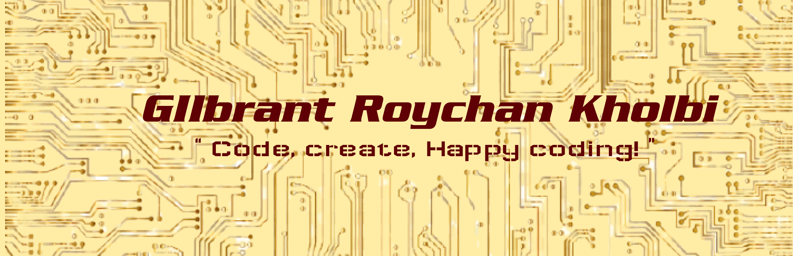

## Hi Friends, RoychanGill here.. 👋

<!--
**GilbrantRoychan/GilbrantRoychan** is a ✨ _special_ ✨ repository because its `README.md` (this file) appears on your GitHub profile.

Here are some ideas to get you started:

- 🔭 I’m currently working on ...
- 🌱 I’m currently learning ...
- 👯 I’m looking to collaborate on ...
- 🤔 I’m looking for help with ...
- 💬 Ask me about ...
- 📫 How to reach me: ...
- 😄 Pronouns: ...
- ⚡ Fun fact: ...
-->

- 🌱 I’m currently learning **[Java](https://www.java.com/en/)**
- 🇮🇩 Iam from Indonesia

###### Skill:

###### you can found me in:

  
